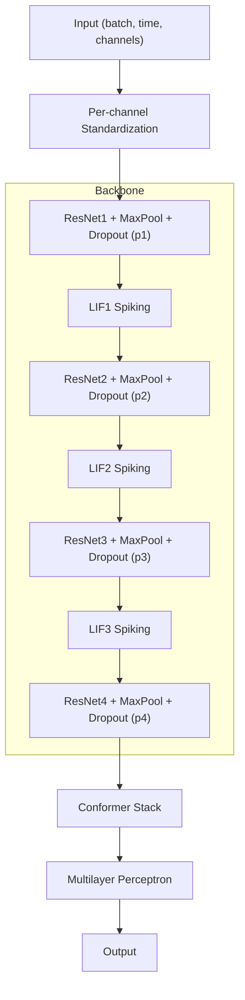

# Spiking-NN-SSL

## This codebase was developed as part of the experiments for the following papers
Codebase Author: Quoc Thinh Vo - qv23 [at] drexel [dot] edu

If you find this code useful and use it, in whole or in part, please consider citing the following papers:

#### [Spiking Attention Network: A Hybrid Neuromorphic Approach to Underwater Acoustic Localization and Zero-shot Adaptation](https://ieeexplore.ieee.org/document/11464621/)
Published in 2026 51st IEEE International Conference on Acoustics, Speech, and Signal Processing (ICASSP)
```bibtex
@inproceedings{vo2026sa-net,
  title={Spiking Attention Network: A Hybrid Neuromorphic Approach to Underwater Acoustic Localization and Zero-shot Adaptation},
  author={Vo, Quoc Thinh and Han, David K},
  booktitle={2026 51st IEEE International Conference on Acoustics, Speech, and Signal Processing (ICASSP)},
  pages={1--5},
  year={2026},
  organization={IEEE}
}
```

#### [Adaptive Control Attention Network for Underwater Acoustic Localization and Domain Adaptation](https://ieeexplore.ieee.org/abstract/document/11226378/)
Published in 2025 33rd European Signal Processing Conference (EUSIPCO)
```bibtex
@inproceedings{vo2025aca-net,
  title={Adaptive Control Attention Network for Underwater Acoustic Localization and Domain Adaptation},
  author={Vo, Quoc Thinh and Woods, Joe and Chowdhury, Priontu and Han, David K},
  booktitle={2025 33rd European Signal Processing Conference (EUSIPCO)},
  pages={1--5},
  year={2025},
  organization={IEEE}
}
```

Also, consider citing the paper on training SNNs that we referred to:
```bibtex
@article{eshraghian2023training,
  title={Training spiking neural networks using lessons from deep learning},
  author={Eshraghian, Jason K and Ward, Max and Neftci, Emre and Wang, Xinxin
              and Lenz, Gregor and Dwivedi, Girish and Bennamoun, Mohammed and
             Jeong, Doo Seok and Lu, Wei D},
  journal={Proceedings of the IEEE},
  volume={111},
  number={9},
  pages={1016-1054},
  year={2023}
}
```

## How to Run

### Prerequisites

You will need your own dataset, or you can download the SWellEx-96 dataset from the [Marine Physical Laboratory](https://swellex96.ucsd.edu/) if you would like to reproduce the SWellEx-96 experiment.

After downloading the data, follow the instructions on the SWellEx-96 website to run the preprocessing steps in MATLAB and export it to a `.csv` file that can be used as input in the `parameters.yaml`.

If you need additional help, you may contact us for access to a preprocessed `dataset.pkl` file.

Before running scripts, check `parameters.yaml` for paths, data settings, and hyperparameters.

If you only want to import and run the SA-Net model, see: [SAnet pypi Usage](#sanet)

### Option 1: Run with UV

Prerequesite: https://docs.astral.sh/uv/

Simply run any scripts with `uv`

```bash
uv sync
uv run python3 underwater-ssl/main.py --params-file=parameters.yaml feature_extractor
uv run python3 underwater-ssl/main.py --params-file=parameters.yaml model_trainer
uv run python3 underwater-ssl/main.py --params-file=parameters.yaml --run-test-only model_trainer
```

### Option 2: Run with Docker

#### Build the image (first-time setup)
```bash
./run.sh build_docker_image
```

#### Start feature extraction (for the raw-signal spiking setup, this step simply splits the audio into 1-second segments and assigns labels accordingly)
```bash
./run.sh preprocess_features --with-docker
```

#### Train the model
Test will automatically run when `run_inference_mode=True` in `parameters.yaml`.
```bash
./run.sh train_model --with-docker
```

#### Test a pretrained model
Set `pretrained_model_path` in `parameters.yaml`, then run:
```bash
./run.sh test_model --with-docker
```

### Option 3: Run without Docker

If `uv` and `Docker` are not available, remove the `--with-docker` option and run the Python scripts directly.

```bash
python3 -m venv .venv
source .venv/bin/activate
pip install -r requirements.txt
./run.sh preprocess_features
./run.sh train_model
./run.sh test_model
```

### Option 4: Direct Python Execution

#### Init virtual env
```bash
python3 -m venv .venv
source .venv/bin/activate
```

#### Install the dependencies
```bash
pip install -r requirements.txt
```
#### Start feature extraction
```bash
python3 underwater-ssl/main.py --params-file=parameters.yaml feature_extractor
```

#### Train the model
Test will automatically run when `run_inference_mode=True` in `parameters.yaml`.
```bash
python3 underwater-ssl/main.py --params-file=parameters.yaml model_trainer
```

#### Test a pretrained model
Set `pretrained_model_path` in `parameters.yaml`, then run:
```bash
python3 underwater-ssl/main.py --params-file=parameters.yaml --run-test-only model_trainer
```

### For iMaPLe Research Lab Servers

Please run in your own environment.

Do not override my virtual environment if you use the setup below:
```bash
cd ~qv23/user_data/clean-code-swell
```

```bash
source swell-env/bin/activate
```
### Run with ./run_imaple.sh
```bash
./run_imaple.sh preprocess_features
./run_imaple.sh train_model
./run_imaple.sh test_model
```

## SAnet

Spiking Attention Network (SA-Net) model package.

## Install

```bash
pip3 install SAnet
```

Or

```bash
uv add SAnet
```

## Usage

### Minimal

```python
import torch
import SAnet

model = SAnet.SA_NET()

batch_size = 2
time_steps = 1500
x = torch.randn(batch_size, time_steps, 21)

with torch.no_grad():
	y = model(x)
	# expected torch.Size([2, 1])

print(y.shape)
```

### All Parameters

```python
import torch
import SAnet

model = SAnet.SA_NET(
	input_channels=21,
	output_channels=1,
	middle_channels=11,
	seed=42,
	spike_slope=25,
	lif1_beta=0.9956,
	lif2_beta=0.9821,
	lif3_beta=0.930,
	conformer_dim=512,
	conformer_depth=2,
	conformer_dim_head=64,
	conformer_heads=8,
	conformer_ff_mult=4,
	conformer_conv_expansion_factor=2,
	conformer_conv_kernel_size=24,
	conformer_attn_dropout=0.1,
	conformer_ff_dropout=0.1,
	conformer_conv_dropout=0.1,
	dropout_p1=0.0,
	dropout_p2=0.1,
	dropout_p3=0.1,
	dropout_p4=0.1,
)

batch_size = 2
time_steps = 1500
x = torch.randn(batch_size, time_steps, 21)

with torch.no_grad():
    y = model(x)
    # expected torch.Size([2, 1])

print(y.shape)
```

## Model Notes

- Input tensor shape: [batch, time, channels]
- The forward pass applies per-channel standardization before the backbone.
- The network uses ResNet-style 1D blocks, spiking neurons, and Conformer layers.
- Model initialization sets a deterministic seed (Python, NumPy, and PyTorch) and enables deterministic CUDA behavior.

## Architecture Diagram



## Parameters

- `input_channels` (default: 21): Number of input channels.
- `output_channels` (default: 1): Number of output channels.
- `middle_channels` (default: 11): Number of intermediate channels before the final projection.
- `seed` (default: 42): Random seed for reproducibility.
- `spike_slope` (default: 25): Slope for the surrogate spike gradient.
- `lif1_beta`, `lif2_beta`, `lif3_beta` (default: 0.9956, 0.9821, 0.930): Decay rates for spiking neurons.
- `conformer_dim` (default: 512): Conformer model dimension.
- `conformer_depth` (default: 2): Number of Conformer blocks.
- `conformer_dim_head` (default: 64): Attention head dimension.
- `conformer_heads` (default: 8): Number of attention heads.
- `conformer_ff_mult` (default: 4): Feedforward expansion multiplier.
- `conformer_conv_expansion_factor` (default: 2): Conformer conv expansion factor.
- `conformer_conv_kernel_size` (default: 24): Conformer conv kernel size.
- `conformer_attn_dropout` (default: 0.1): Attention dropout in Conformer.
- `conformer_ff_dropout` (default: 0.1): Feedforward dropout in Conformer.
- `conformer_conv_dropout` (default: 0.1): Convolution dropout in Conformer.
- `dropout_p1`, `dropout_p2`, `dropout_p3`, `dropout_p4` (default: 0.0, 0.1, 0.1, 0.1): Dropout probabilities for the 1D dropout layers.
